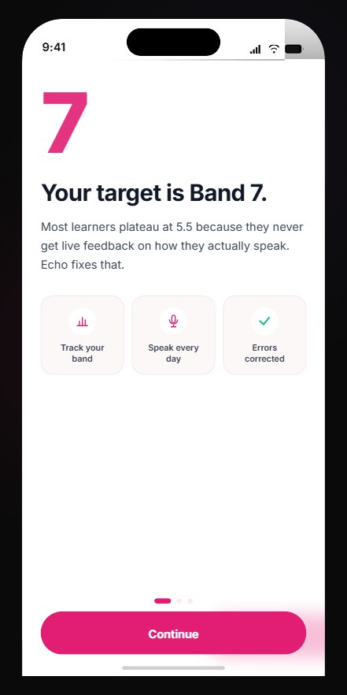
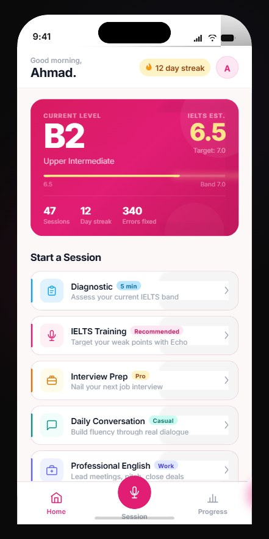
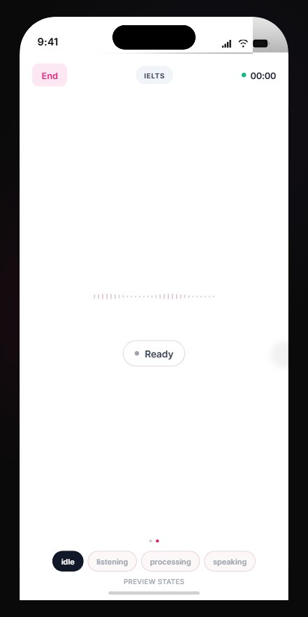
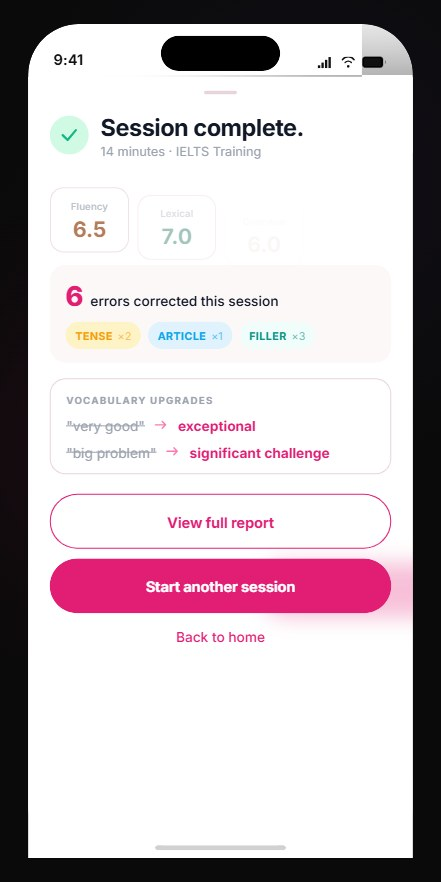
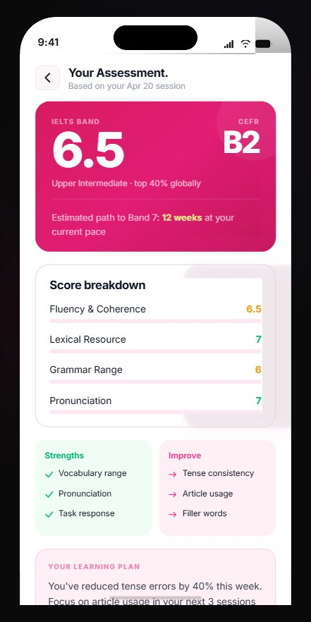
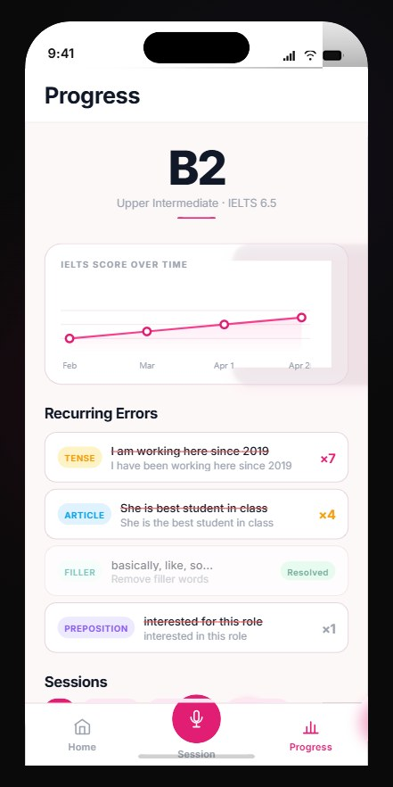

# Echo — AI English Coaching App

> Voice-first AI English coach powered by Google Gemma 3, built for IELTS Band 7+, interview mastery, and real-time spoken fluency improvement.

Echo listens while you speak, responds naturally in under 750 ms, catches grammar and vocabulary mistakes in parallel, and delivers personalised coaching through a modular voice AI architecture.

---

## What Makes Echo Different

### Core Differentiators:
- **Google Gemma 3 (27B) conversational backend**
- **Native grammar correction tool architecture**
- **Real-time correction cards during live speech**
- **IELTS / CEFR diagnostic scoring**
- **Longitudinal memory + session insight tracking**
- **Sub-750 ms voice-to-voice latency**

---

## Screenshots

<table>
  <tr>
    <td align="center"><b>Onboarding</b></td>
    <td align="center"><b>Home</b></td>
    <td align="center"><b>Live Session</b></td>
  </tr>
  <tr>
    <td></td>
    <td></td>
    <td></td>
  </tr>
  <tr>
    <td align="center"><b>Session Complete</b></td>
    <td align="center"><b>Diagnostic Results</b></td>
    <td align="center"><b>Progress</b></td>
  </tr>
  <tr>
    <td></td>
    <td></td>
    <td></td>
  </tr>
</table>

---

## Updated Tech Stack

| Layer | Technology |
|-------|-------------|
| Mobile | React Native + Expo SDK 54 |
| Routing | expo-router v6 |
| Backend | FastAPI (Python 3.11) + async WebSockets |
| Speech-to-text | Groq Whisper Large-v3 (~200 ms) |
| Primary Language Model | Google Gemma 3 27B via Google AI Studio |
| Grammar Engine | Gemma native grammar correction tool |
| Fallback LLM | Groq Llama 3.3 70B / 3.1 8B |
| Text-to-speech | Cartesia Sonic streaming / Edge TTS (dev) |
| Voice activity | Silero VAD via ONNX (on-device, 0 ms) |
| Database + Auth | Supabase (PostgreSQL + Row Level Security) |
| Session state | Upstash Redis |
| Hosting | Railway.app / Render |

---

## Architecture Philosophy

Echo uses a **three-stream modular pipeline**:

### Stream A:
**Groq Whisper STT** → speech transcription

### Stream B:
**Gemma 3 Conversation Engine** → live coaching conversation

### Stream C:
**Gemma Grammar Tool** → parallel correction analysis

### Result:
Conversation continues naturally while correction appears live without blocking.

---

## End-to-End Latency Goal

**< 750 ms**  
(User finishes speaking → AI first spoken response)

---

## Project Structure

```txt
echocoach/
├── backend/
│   ├── main.py                     # FastAPI app
│   ├── routers/
│   │   ├── ws.py                   # WebSocket orchestration
│   │   ├── auth.py                 # Authentication routes
│   │   └── sessions.py             # Session + analytics endpoints
│   ├── services/
│   │   ├── stt.py                  # Groq Whisper STT
│   │   ├── llm.py                  # Gemma primary + Groq fallback
│   │   ├── tts.py                  # Cartesia / Edge TTS
│   │   ├── correction.py           # Native grammar correction pipeline
│   │   ├── memory.py               # Longitudinal learning memory
│   │   └── redis_state.py          # Session state
│   ├── prompts/
│   │   ├── diagnostic.py
│   │   ├── training.py
│   │   ├── correction.py
│   │   └── interview.py
│   ├── models/
│   ├── db/
│   └── requirements.txt
│
├── mobile/
│   ├── app/
│   ├── components/
│   ├── hooks/
│   ├── services/
│   └── assets/
│
├── design-preview/
└── README.md
```

---

## How a Session Works

```
User speaks  →  Silero VAD detects end-of-speech
             →  Audio chunks sent over WebSocket
             →  Groq Whisper transcribes (~200 ms)
             →  Gemma 3 streams coaching response
             →  Cartesia TTS speaks reply
             →  Gemma grammar tool checks sentence
             →  CorrectionCard pushed to app while AI is still speaking
```

---


---

## 🛠️ Run Locally

Follow these steps to run Echo on your machine.

### 🔧 Backend Setup (FastAPI)

```bash
cd backend
python -m venv venv
venv\Scripts\activate   # Windows
pip install -r requirements.txt
uvicorn main:app --reload
```
Check: curl http://localhost:8000/health should return {"status":"ok"}

### 📱 Mobile Setup (React Native + Expo)

```bash
cd mobile
npm install
npx expo start
```

## Deployment (Production)

### Backend on Railway

```bash
npm install -g @railway/cli
railway login
cd backend
railway init
railway up
```

Set all env vars in Railway dashboard → **Variables**. Make sure to set `DEV_TTS=cartesia` and add your `CARTESIA_API_KEY`.

### Mobile build (EAS)

```bash
cd mobile
npm install -g eas-cli
eas login
eas build --platform android   # APK / AAB
eas build --platform ios       # requires Apple Developer account ($99/yr)
```

Update `EXPO_PUBLIC_BACKEND_HTTP_URL` and `EXPO_PUBLIC_BACKEND_WS_URL` to your Railway deployment URL before building.

---

## Session Modes

| Mode | Description |
|------|-------------|
| **Diagnostic** | 5-min assessment → CEFR band + IELTS estimate + learning plan |
| **IELTS Training** | Targeted practice on your weak areas |
| **Interview Prep** | STAR method coaching for job interviews |
| **Daily Conversation** | Casual fluency building |
| **Professional English** | Formal meetings and emails |
| **Accent Coaching** | British or American pronunciation focus |

---

## Testing Checklist

- [ ] `curl http://localhost:8000/health` returns `{"status":"ok"}`
- [ ] Register new user → JWT returned → stored in Supabase `users` table
- [ ] Start session → WS `session_ready` received in < 3 s
- [ ] Speak → transcription logged → AI responds → audio plays
- [ ] Interruption: speak over AI → AI stops immediately
- [ ] Correction card appears while AI audio is still playing
- [ ] Session end → scores written to `sessions` table
- [ ] Home screen shows correct streak + stats
